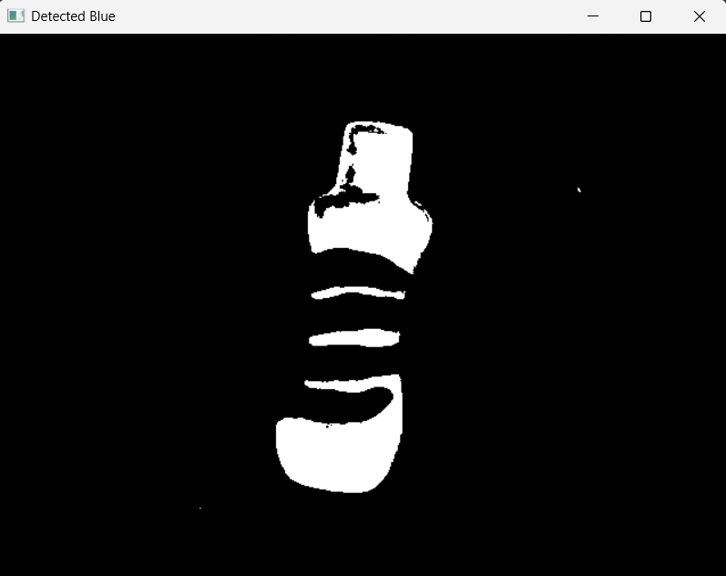
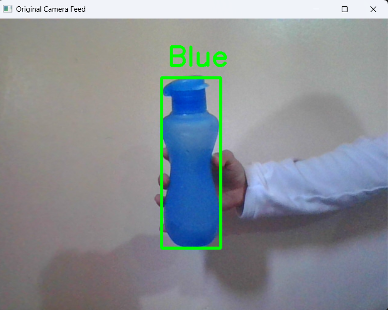
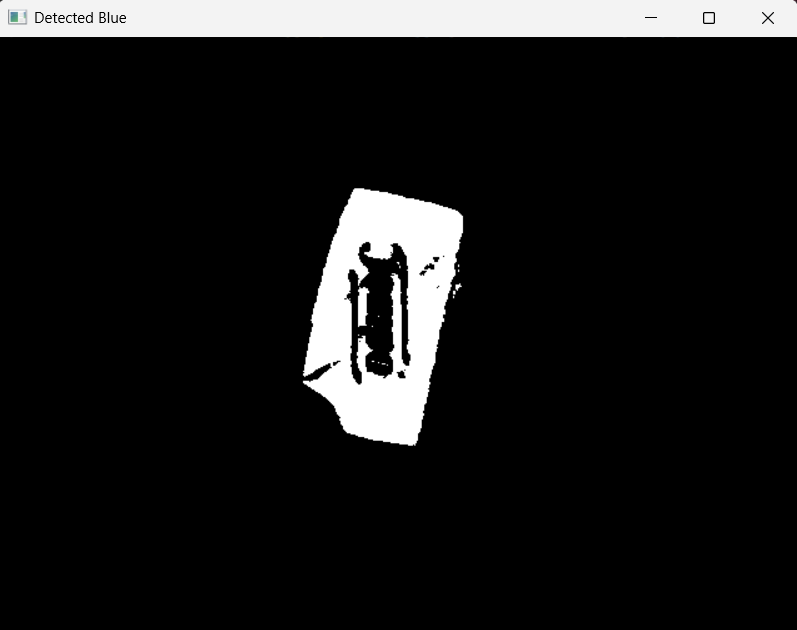
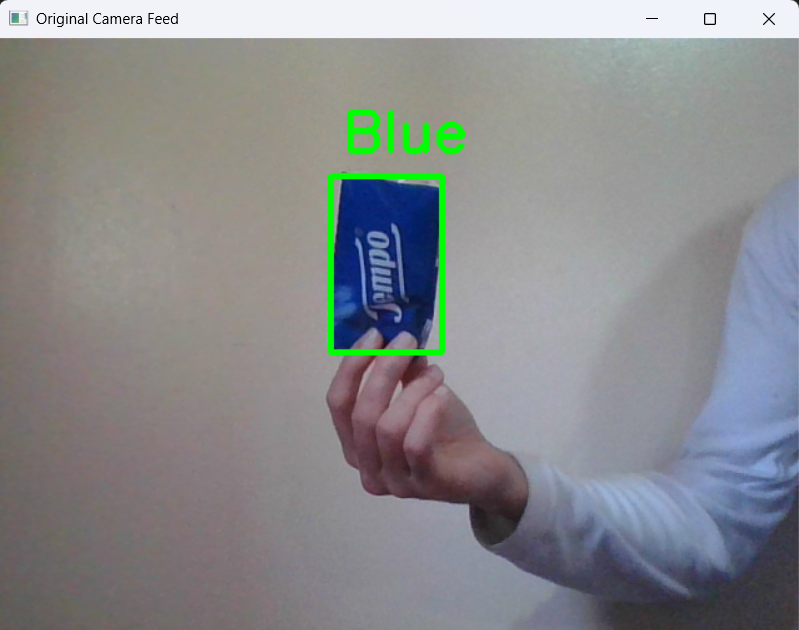
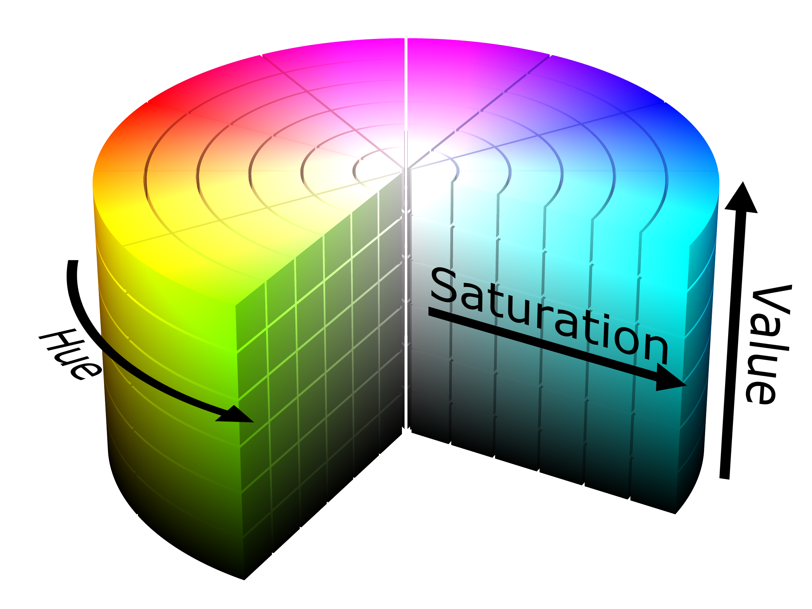

# 🔍 Blue Object Detector

> Real-time blue object detection using OpenCV and Python


## 📸 Demo

<div align="center">
  <div style="display: flex; align-items: center; justify-content: center;">
    
    <span style="font-size: 24px; margin: 0 10px;">➡️</span>
    
  </div>
  <br />
  <div style="display: flex; align-items: center; justify-content: center;">
    
    <span style="font-size: 24px; margin: 0 10px;">➡️</span>
    
  </div>
</div>

<p align="center">
  
</p>

## ✨ Features

- 🔵 Real-time blue color detection
- 📦 Bounding box visualization
- 🏷️ Object labeling
- 🎥 Works with webcam input
- 🎨 HSV color space filtering
- 🖥️ Simple, clean interface

## 🚀 Installation

```bash
# Clone the repository
git clone https://github.com/yourusername/blue-object-detector.git
cd blue-object-detector

# Create virtual environment (optional)
python -m venv venv
source venv/bin/activate  # On Windows: venv\Scripts\activate

# Install dependencies
pip install -r requirements.txt
```

## 📋 Requirements

- Python 3.6+
- OpenCV (`opencv-python`)
- NumPy
- Pillow

## 💻 Usage

Simply run the script to start detection:

```bash
python blue_detector.py
```

- Press 'q' to quit the application
- The webcam will open automatically
- Hold blue objects in front of the camera to see detection

## ⚙️ Configuration

You can adjust the HSV color range in the code to detect different shades of blue or other colors:

```python
# Define HSV color range for blue detection
lowerColor = np.array([100, 180, 100])  # Lower bound of blue in HSV
upperColor = np.array([140, 240, 255])  # Upper bound of blue in HSV
```

## 🔧 How It Works

1. Captures video from the webcam
2. Converts each frame from BGR to HSV color space
3. Creates a mask for blue pixels using the HSV color range
4. Finds the bounding box around the detected blue areas
5. Draws a rectangle and label on the original frame
6. Displays the result in real-time


## 🙏 Acknowledgements

- [OpenCV](https://opencv.org/) for the amazing computer vision library
- [NumPy](https://numpy.org/) for numerical operations
- [Pillow](https://python-pillow.org/) for image processing

---

<div align="center">
  Made with ❤️ by Aymane Elm
</div>